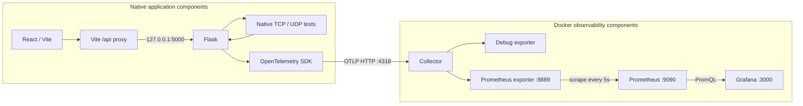

# NetBench — Observable TCP/UDP Network Performance Analysis System

React + Vite + TypeScript dashboard backed by Flask and real Python TCP/UDP
socket tests. No mock fallback. OpenTelemetry metrics reach a Dockerized
Collector with debug output, Prometheus storage, and a provisioned Grafana dashboard.
Frontend observability status cards remain placeholders; API Online checks Flask only.

## Local development

Install dependencies if needed:

```sh
npm install
source .venv/bin/activate
pip install -r backend/requirements.txt
```

With Docker Desktop running, use these five terminals **from the project root**,
in this order. Network servers are
independent services; Flask never starts a server per HTTP request.

Terminal 1 — observability:

```sh
docker compose config --quiet
docker compose up -d
docker compose ps
```

Terminal 2 — TCP:

```sh
source .venv/bin/activate
python -m backend.network.tcp_server --host 127.0.0.1
```

Terminal 3 — UDP:

```sh
source .venv/bin/activate
python -m backend.network.udp_server --host 127.0.0.1
```

Terminal 4 — Flask:

```sh
source .venv/bin/activate
export OTEL_EXPORTER_OTLP_METRICS_ENDPOINT=http://127.0.0.1:4318/v1/metrics
python -m backend.app
```

Terminal 5 — React:

```sh
npm run dev
```

Open the actual URL printed by `npm run dev` (usually **http://localhost:5173**;
Vite can select 5174 or another available port). Select Compare and click Start
Network Test. Flask stays on 5000, TCP on 5001, and UDP on 5002.

Axios defaults to the relative base URL `/api`. During development, Vite proxies
`/api` to `http://127.0.0.1:5000` with `changeOrigin: true`, preserving the path.
The browser therefore requests its own origin, for example
`http://localhost:5174/api/health`, avoiding Safari/browser cross-origin issues.
Restart Vite after changing `vite.config.ts`. No browser security changes are
needed. Flask-CORS remains available for direct access from its existing allowed
origins; local development no longer depends on that allowlist matching Vite's port.

Optional deployment override: set `VITE_API_BASE_URL` to an API base URL including
`/api` before starting/building Vite. Cross-origin overrides require appropriate
server CORS. A production build needs a same-origin reverse proxy for `/api` or
that explicit override; the Vite development proxy is not a production server.
The upstream uses IPv4 `127.0.0.1` because `localhost:5000` may reach macOS AirPlay.

## Access and shutdown

| Service | Local URL |
|---|---|
| NetBench React | Actual URL printed by `npm run dev`; port may change |
| Flask health | http://127.0.0.1:5000/api/health |
| Proxied health | `/api/health` on the actual Vite URL |
| Prometheus | http://127.0.0.1:9090 |
| Grafana | http://127.0.0.1:3000 |
| Provisioned dashboard | http://127.0.0.1:3000/d/netbench-overview |

Stop React, Flask, TCP, and UDP using **Ctrl+C in each native terminal**.
Stop observability with `docker compose stop`; `docker compose up -d` starts it
again. Both retain named volumes. **`docker compose down -v` deletes persistent
Prometheus and Grafana volumes: use it only if you intend to erase that data.**

## Demo checklist

1. Run the five-terminal startup sequence; show `docker compose ps`.
2. Open the actual Vite URL and verify **API Online**.
3. Select host `127.0.0.1`, Compare, and 1 MB; run the test.
4. Explain throughput, application RTT, and transfer duration. TCP loss is N/A;
   UDP loss is observed missing DATA sequences, with no artificial loss.
5. Run Compare at 10 MB. Explain loopback scope and UDP's 150 ms collection window.
6. Open Prometheus and query `netbench_network_tests_total{job="netbench"}`.
7. Allow about 40 seconds for SDK export, batching, scraping, and dashboard refresh.
8. Open Grafana (local defaults `admin` / `netbench-local`) and show all twelve
   panels. Explain SDK → Collector → Prometheus → Grafana and the debug exporter.
9. Explain that React shows individual results, Grafana shows aggregates/history,
   and React's observability cards are still placeholders.

Phase 10 validation and complete real loopback measurements are recorded in
[the final integration report](docs/phase10-loopback-results.md), with
[unrounded API evidence](docs/phase10-results.json). Two-device LAN validation
remains Phase 11; application services run natively.

## API

- `GET /api/health`: Flask availability only, not TCP/UDP server health.
- `POST /api/test/tcp`: runs the TCP client against the supplied host:5001.
- `POST /api/test/udp`: runs the UDP client against the supplied host:5002.
- `POST /api/test/compare`: runs TCP **then** UDP with the same settings.

POST body: `{"host":"127.0.0.1","size_mb":10}`. Host must be a nonempty IPv4
address or hostname; size must be an integer from 1, 5, 10, 25, 50. The host
is resolved/contacted by the Flask machine, not the browser. The local API
binds to 127.0.0.1 and is intended for controlled development use.

Errors are JSON: invalid input/DNS (400), overlapping test (409), oversized
body (413), engine/protocol error (502), refused server connection (503),
timeout (504), or unexpected server error (500). Comparisons fail as a whole
if an engine fails; error responses identify the failed protocol and any
completed protocol without substituting measurements. The single-process
API serializes test requests with a lock; this is not a distributed job system.

## Measurement interpretation

- 1 MB means 1,048,576 bytes. API values are unrounded; the UI formats them.
- TCP packet counts and IP packet loss are **N/A**, not zero. Application-level
  TCP sockets do not directly expose underlying IP packet-loss events here. TCP
  provides reliability, but NetBench does not instrument kernel retransmissions.
- UDP loss comes from missing unique DATA sequence numbers; no artificial loss
  or DATA retransmission is used. Duplicate packets are not double-counted.
- UDP throughput is received-payload goodput. Its elapsed time includes the
  150 ms reorder window and END/RESULT control exchanges/retries. TCP elapsed
  time includes its final ACK. These timing differences affect comparisons.
- Application RTT includes peer processing; it is not ICMP ping latency.
- Phase 10 uses **127.0.0.1: all traffic stays on the same Mac**. Results measure
  loopback/application performance, **not Internet speed, Wi-Fi throughput, or
  Ethernet throughput**. TCP throughput can appear extremely high. UDP loss
  can be zero or nonzero due to local buffer pressure. Two-device LAN testing
  remains unperformed (Phase 11).
- Start is disabled during a request. API health refreshes every 15 seconds.
  The browser request timeout is 180 seconds; if it expires or you leave the
  page, an in-progress server-side test may continue until it ends/times out.

More UDP protocol details: [backend/network/UDP.md](backend/network/UDP.md).

## Validation and standalone clients

```sh
source .venv/bin/activate
python -m compileall -q backend
python -m unittest discover -s backend/tests -v
npm run build
npm run lint

python -m backend.network.tcp_client --host 127.0.0.1 --size 10
python -m backend.network.udp_client --host 127.0.0.1 --size 10
```

Tests include mocked HTTP contract tests and real localhost UDP transfers.
Live socket tests require permission to bind/connect local sockets.

## OpenTelemetry metrics (Phase 6)

Use the existing project-root `.venv` for all backend commands. OpenTelemetry
1.45.0 is installed there and pinned in `backend/requirements.txt`; no second
environment is needed. Legacy environments are ignored, not deleted.

Flask records completed engine results through `backend.telemetry` using meter
`netbench.network`. The SDK resource contains only `service.name=netbench-api`
and `service.version=1.0.0`. NetBench still computes all network measurements;
telemetry only records, aggregates, and exports them.

```sh
source .venv/bin/activate
export OTEL_EXPORTER_OTLP_METRICS_ENDPOINT=http://127.0.0.1:4318/v1/metrics
# Optional: milliseconds; default is 30000 (30 seconds).
export OTEL_METRIC_EXPORT_INTERVAL=30000
python -m backend.app
```

The endpoint above is the default. A PeriodicExportingMetricReader exports
OTLP/HTTP protobuf in the background with a two-second exporter timeout.
**Grafana is now provisioned in Phase 9.** Start the observability stack
as described below. Connection/export warnings while it is stopped are expected; they do not fail HTTP
requests or network tests. No request performs an export or force-flush.
Frontend integration cards remain Not Connected.

Instruments (all prefixed `netbench.network.`):

| Name | Type | Unit | Attributes |
|---|---|---|---|
| tests | Counter | — | protocol, status |
| throughput | Histogram | Mbit/s | protocol |
| transfer.duration | Histogram | s | protocol |
| rtt | Histogram | ms | protocol |
| bytes.sent | Counter | By | protocol |
| bytes.received | Counter | By | protocol |
| packets.sent | Counter | — | protocol=udp |
| packets.received | Counter | — | protocol=udp |
| packets.lost | Counter | — | protocol=udp |
| packet.loss | Histogram | % | protocol=udp |

Protocols are `tcp`/`udp`; status is `success`/`failure`. No host addresses,
session IDs, timestamps, or exception details are metric attributes. TCP's
`bytes_transferred` maps to both sent and received payload bytes because its
successful result requires an exact final server acknowledgement. TCP packet
metrics are never recorded. UDP counters use existing result fields directly.
Failed attempts record only the outcome counter. Compare records in the shared
per-protocol helper: TCP once, then UDP once if attempted; no compare metric.

`python -m backend.app` initializes one provider before serving, disables the
reloader, and shuts telemetry down on exit. Importing `backend.app` alone does
not start exporter threads (including during tests). For a future WSGI entrypoint,
call `backend.telemetry.initialize()` once in each serving worker after forking.
`force_flush()` and `shutdown()` are explicit maintenance hooks, never request
hooks. Initialization/recording errors are isolated too; failed initialization
leaves telemetry disabled until process restart. Shutdown does not reinitialize.
Unit tests inject in-memory SDK readers and require no Collector or exporter
network access. Existing live UDP tests still require localhost socket access.

## OpenTelemetry Collector (Phase 7)

Phase 7 introduced the Collector in Docker; Phase 8 adds Prometheus. Flask, React, and TCP/UDP services continue
running natively with the five-terminal startup sequence above. Docker Desktop
must be running; no application containerization is required.

Image: `otel/opentelemetry-collector-contrib:0.161.0`, pinned to the official
[0.161.0 release](https://github.com/open-telemetry/opentelemetry-collector-releases/releases/tag/v0.161.0).
The image uses `/otelcol-contrib` and `/etc/otelcol-contrib/config.yaml`.
Compose mounts `observability/otel-collector-config.yaml` read-only there.

The metrics pipeline is now `otlp → batch → [debug, prometheus]`. Both receiver protocols
bind to `0.0.0.0` **inside** the container so published ports work. Host ports
are restricted to IPv4 loopback:

- OTLP/HTTP metrics: `http://127.0.0.1:4318/v1/metrics` (used by Flask).
- OTLP/gRPC: `127.0.0.1:4317` (available, not used by the current SDK setup).

Phase 8 additionally publishes Collector port 8889 and Prometheus port 9090
on host loopback. Phase 9 also publishes Grafana on loopback port 3000. No extra health ports are published. The debug exporter uses
`verbosity: detailed` to expose resource attributes, metric names, labels, and
values. At this project's default 30-second SDK export interval, volume is
small; Docker rotates logs at 10 MB with three files. These logs are inspection
output, not durable metric storage. There are no trace or log pipelines.

From the project root:

```sh
docker compose config
docker compose up -d otel-collector
docker compose ps
docker compose logs -f otel-collector
```

In the Flask terminal (with `.venv` activated):

```sh
export OTEL_EXPORTER_OTLP_METRICS_ENDPOINT=http://127.0.0.1:4318/v1/metrics
python -m backend.app
```

Run **Compare → 1 MB** in React. Wait at least 30 seconds for the periodic SDK
export plus the Collector's one-second batch timeout, then inspect:

```sh
docker compose logs --since 2m otel-collector
```

Expect all ten `netbench.network.*` instruments from the table above, resource
`service.name=netbench-api`, `service.version=1.0.0`, `protocol=tcp|udp`, and
`status=success` on the test counter. Packet metrics must be UDP-only. Metric
export timestamps are normal protocol metadata, not custom metric labels.
Repeated cumulative exports are snapshots, not additional test executions.

A simple HTTP reachability check (GET is not a valid OTLP export) is:

```sh
curl -i http://127.0.0.1:4318/v1/metrics
```

An HTTP 405 response establishes receiver reachability; only real exported
metrics in Collector logs establish successful end-to-end delivery.

Stop/restart and cleanup commands:

```sh
docker compose stop otel-collector
docker compose start otel-collector
docker compose down
```

While stopped, another real network test should still succeed and display in
React. After the next periodic export, Flask may log connection/refusal or
export timeout warnings. Restarting the Collector restores its receiver; there
is **no guarantee that all metrics generated during downtime will be delivered
later**, and debug output provides no persistent storage. The UI intentionally
does not claim Connected without an actual backend connectivity mechanism.

Phase 7 established OTLP delivery to the debug exporter. Phase 8 extends this
with Prometheus below; Grafana is covered in Phase 9; application containerization remains future work.

## Prometheus (Phase 8)

Architecture: native TCP/UDP → native Flask → OTel SDK → OTLP/HTTP `:4318` →
Collector → both debug output and Prometheus exporter `:8889` → Prometheus
scrapes → persistent time series and PromQL. React and all network services
remain native on macOS. Phase 9 adds Grafana below. No alerts or application containers are added.

Prometheus is pinned to official image `prom/prometheus:v3.15.0`
([release](https://github.com/prometheus/prometheus/releases/tag/v3.15.0)). This
exact image was pulled and its running binary verified. Collector stays pinned
to `otel/opentelemetry-collector-contrib:0.161.0`.

`observability/prometheus.yml` defines one job, `netbench`, scraping
`otel-collector:8889` every **5 seconds**, with a 5-second evaluation interval.
The hostname resolves over the normal Compose network; container localhost
would point to Prometheus itself. Collector keeps both `debug` and `prometheus`
exporters and uses the existing batch processor.

- Prometheus UI: **http://127.0.0.1:9090**
- Collector exposition: **http://127.0.0.1:8889/metrics**
- Target API: **http://127.0.0.1:9090/api/v1/targets** (expect `health: up`)
- The metrics/config mounts are read-only; host ports are loopback-only.

```sh
docker compose config
docker compose up -d otel-collector prometheus
docker compose ps
docker compose logs -f prometheus
docker compose logs -f otel-collector
curl http://127.0.0.1:8889/metrics
curl http://127.0.0.1:9090/api/v1/targets
```

Use the existing four native-service terminals, `.venv`, and Flask OTLP endpoint
above. Run Compare 1 MB then 10 MB. Allow approximately **40 seconds** for the
30-second SDK export interval, one-second batch timeout, and five-second scrape.
The UI observability placeholders intentionally remain unchanged.

### Observed metric names

These names were inspected in the Collector exposition and queried in
Prometheus; they are not guesses. Histogram bases below expose all three
`_bucket`, `_sum`, and `_count` series.

| OTel instrument (`netbench.network.` prefix) | Actual Prometheus name/base | Type |
|---|---|---|
| tests | `netbench_network_tests_total` | Counter |
| throughput | `netbench_network_throughput_Mbit_per_second` | Histogram |
| transfer.duration | `netbench_network_transfer_duration_seconds` | Histogram |
| rtt | `netbench_network_rtt_milliseconds` | Histogram |
| bytes.sent | `netbench_network_bytes_sent_total` | Counter |
| bytes.received | `netbench_network_bytes_received_total` | Counter |
| packets.sent | `netbench_network_packets_sent_total` | UDP counter |
| packets.received | `netbench_network_packets_received_total` | UDP counter |
| packets.lost | `netbench_network_packets_lost_total` | UDP counter |
| packet.loss | `netbench_network_packet_loss_percent` | UDP histogram |

Prometheus adds scrape labels `job="netbench"`, `instance="otel-collector:8889"`.
The exported service's job label is retained as `exported_job="netbench-api"`.
Application labels remain low-cardinality `protocol` and test `status`.

### Verified PromQL

Run in the Prometheus UI or `/api/v1/query`. These exact expressions were
executed successfully. Means are cumulative per-test observation means since
SDK startup, **not the latest test**, link speed, or byte-weighted throughput.
Counters can reset when Flask restarts; repeated scrapes do not imply new tests.

```promql
# Target health: 1 means UP
up{job="netbench"}

# Successful/failed attempts grouped by protocol and outcome
sum by (protocol, status) (netbench_network_tests_total{job="netbench"})

# Throughput observations and mean Mbps
sum by (protocol) (netbench_network_throughput_Mbit_per_second_count{job="netbench"})
sum by (protocol) (netbench_network_throughput_Mbit_per_second_sum{job="netbench"}) / sum by (protocol) (netbench_network_throughput_Mbit_per_second_count{job="netbench"})

# Mean application RTT in ms
sum by (protocol) (netbench_network_rtt_milliseconds_sum{job="netbench"}) / sum by (protocol) (netbench_network_rtt_milliseconds_count{job="netbench"})

# Mean transfer duration in seconds
sum by (protocol) (netbench_network_transfer_duration_seconds_sum{job="netbench"}) / sum by (protocol) (netbench_network_transfer_duration_seconds_count{job="netbench"})

# Received and sent payload bytes, by protocol
netbench_network_bytes_received_total{job="netbench"}
netbench_network_bytes_sent_total{job="netbench"}

# UDP DATA packet totals
netbench_network_packets_sent_total{job="netbench",protocol="udp"}
netbench_network_packets_received_total{job="netbench",protocol="udp"}
netbench_network_packets_lost_total{job="netbench",protocol="udp"}

# Mean per-test UDP loss percentage
sum(netbench_network_packet_loss_percent_sum{job="netbench",protocol="udp"}) / sum(netbench_network_packet_loss_percent_count{job="netbench",protocol="udp"})

# Must return no series: TCP packet statistics are unavailable
{__name__=~"netbench_network_packet.*",protocol="tcp",job="netbench"}
```

For example, use curl without hand-encoding PromQL:

```sh
curl -G http://127.0.0.1:9090/api/v1/query \
  --data-urlencode 'query=sum by (protocol, status) (netbench_network_tests_total{job="netbench"})'
```

TCP packet loss remains N/A and no TCP packet series are emitted. RTT is
application-level, not ICMP. UDP throughput is receiver goodput and includes
its reorder window in elapsed time. Localhost results measure loopback, not
physical Ethernet/Wi-Fi performance. Histogram instruments are unchanged;
default buckets are coarse for very short durations and high loopback speeds,
so means/counts are useful here, while bucket-based percentiles can be coarse.

### Storage, restart, and outage behavior

Compose's named volume `prometheus-data` (default project name:
`netbench_prometheus-data`) mounts at `/prometheus`. It preserves stored samples
across normal restarts and container recreation. Retention flags are
`--storage.tsdb.retention.time=7d` and `--storage.tsdb.retention.size=1GB`.
This Prometheus version reports these as **1 week / 1 GiB**. Whichever retention
condition is reached first governs deletion; this is not a strict filesystem
quota, and active head/WAL data and deletion timing can add disk overhead.

```sh
docker compose restart prometheus
docker compose stop prometheus
docker compose start prometheus
docker compose logs --tail 30 prometheus
docker compose stop otel-collector prometheus
docker compose down
```

Normal `docker compose down` preserves the named volume. **Do not use `down -v`
when retaining measurements.** Check that the target returns UP after restart.
Stored historical samples were compared at the same pre-restart timestamp,
so persistence validation does not confuse newly scraped data with old data.

Stopping Prometheus does not stop native network tests, SDK exports, or Collector
debug output. On restart, scraping resumes. Samples during the scrape outage
are not guaranteed to have been stored; a later cumulative snapshot is not a
reconstruction of every missing sample. Collector exposition is in-memory and
is not itself durable storage. Grafana is provisioned in Phase 9 below.

## Grafana (Phase 9)

Grafana queries Prometheus and automatically provisions **NetBench — TCP vs UDP
Network Performance**, UID `netbench-overview`, in folder **NetBench**.
Official image: `grafana/grafana:13.2.3`, verified by pulling and running it.
Collector `0.161.0` and Prometheus `v3.15.0` are unchanged.



### Start and log in

```sh
# Optional overrides, set before the FIRST start with a new Grafana volume:
# export GRAFANA_ADMIN_USER=your-local-admin
# export GRAFANA_ADMIN_PASSWORD=your-local-password

docker compose config --quiet
docker compose up -d otel-collector prometheus grafana
docker compose ps
docker compose logs -f grafana
```

Open **http://127.0.0.1:3000**. Local development defaults are username **admin**,
password **netbench-local**, configurable through `GRAFANA_ADMIN_USER` and
`GRAFANA_ADMIN_PASSWORD` (mapped to Grafana's `GF_SECURITY_ADMIN_*` settings).
These shared defaults are only for this loopback-bound educational setup.
Existing admin credentials are stored in the named volume: changing bootstrap
environment variables does not reset an existing user's password. No credentials
are embedded in dashboard JSON. Signup is disabled; the default theme is dark.
Automatic plugin preinstallation and analytics checks are disabled; only the
built-in Prometheus data source is needed.

Dashboard: **http://127.0.0.1:3000/d/netbench-overview**. No manual JSON import or
manual data-source creation is needed. The existing native application startup
commands stay the same; React observability status placeholders stay unchanged.

### File-based provisioning

- `observability/grafana/provisioning/datasources/prometheus.yml`: default
  Prometheus data source, stable UID `prometheus`, proxy access to
  **http://prometheus:9090**, five-second scrape interval metadata.
- `observability/grafana/provisioning/dashboards/dashboards.yml`: file provider
  for `/var/lib/grafana/dashboards`, refreshed every ten seconds.
- `observability/grafana/dashboards/netbench-overview.json`: dashboard source.
  Default range is last 30 minutes; refresh is five seconds. Both protocols
  remain visible, so no filtering variable is necessary.
- The data-source/provider directories and dashboard JSON directory are read-only mounts. Grafana’s other built-in provisioning directories remain intact. Change files to update
  the dashboard; UI saves are disabled for reproducibility.
- Named volume `grafana-data` (normally `netbench_grafana-data`) mounts at
  `/var/lib/grafana`, persisting Grafana's native internal state and preferences.
  No separate database service is added.

### Panels and interpretation

Five sections contain twelve data panels plus a reading-notes panel:

1. Total Successful Tests — cumulative successful attempts; Compare counts twice.
2. Successful Tests by Protocol — TCP and UDP cumulative counts.
3. Average Throughput — histogram sum/count; fixed Mbit/s units for comparison.
4. Average Application RTT — histogram sum/count in milliseconds, not ICMP.
5. Throughput over Time — rolling increase(sum)/increase(count), by protocol.
6. Application RTT over Time — the same rolling calculation for application RTT.
7. Average Transfer Duration — histogram sum/count in seconds.
8. Payload Bytes Sent & Received — cumulative counters for each protocol.
9. Average UDP Packet Loss — arithmetic mean of observed per-test percentages.
10. UDP DATA Packets — actual sent, unique received, and lost packet counters.
11. UDP Packet Loss over Time — UDP-only rolling mean of loss observations.
12. Successful Test Activity over Time — rolling increases of successful counts.

**Every panel's complete PromQL expression and description is recorded in
[the dashboard query reference](observability/grafana/README.md).** All 24 target
expressions were validated against Prometheus and through Grafana's query API.

Stat panels use current cumulative data since SDK startup, not the most recent
test or a total restricted to the selected display range. Time-series panels
use `$__rate_interval` with a 30-second minimum query step, resulting in at least
a two-minute window to include multiple SDK exports. Windows without new
observations have gaps; no fake zeros are added. The positive-denominator filter
avoids division by zero. Activity increases may be fractional due to Prometheus
extrapolation. A counter's first sample cannot establish a historical increase.

TCP is green and UDP purple. TCP packet counts/loss remain **unavailable**, with
no invented zero series. UDP zero loss, when measured, is valid. Throughput is
not plotted as raw histogram sum. Localhost results are loopback measurements;
physical LAN/Wi-Fi testing remains postponed. UDP duration includes its reorder
window, so TCP/UDP timing semantics differ. Large throughput differences can
make the smaller series visually close to zero on the shared linear axis.

### Validate, restart, and stop

Run real Compare tests at 1 MB, 5 MB, and 10 MB in React. Allow approximately
40 seconds for SDK export, batching, scrape, and Grafana refresh. Earlier and
later observations are needed for rolling increases. Data-source health can be
checked in Grafana or authenticated `GET /api/datasources/uid/prometheus/health`.

```sh
docker compose restart grafana
docker compose stop prometheus
docker compose start prometheus
docker compose logs --tail 40 grafana
docker compose stop grafana prometheus otel-collector
docker compose down
```

Normal shutdown/recreation retains named volumes; avoid `down -v` when keeping
state. Provisioned files remain the dashboard/data-source source of truth.
Grafana unavailability does not affect tests. If Prometheus is stopped, Grafana
queries fail until it returns, while NetBench, OTLP delivery and Collector debug
output continue. Missing scrape samples are not guaranteed to be recovered.
No application containerization or two-device LAN testing is included.
